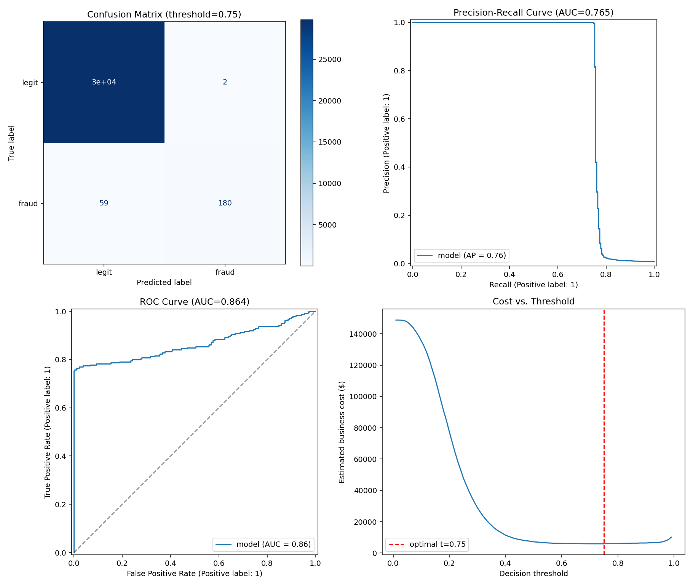

# Fraud Detection Model — Evaluation Report

**Model:** logistic_regression
**Test set size:** 30,000 transactions (239 fraud, 0.797%)

## Headline metrics
| Metric | Value |
|---|---|
| PR-AUC | 0.7647 |
| ROC-AUC | 0.8643 |

## Classification report @ threshold = 0.50 (default)
```
              precision    recall  f1-score   support

       legit       1.00      0.99      0.99     29761
       fraud       0.38      0.76      0.51       239

    accuracy                           0.99     30000
   macro avg       0.69      0.88      0.75     30000
weighted avg       0.99      0.99      0.99     30000

```

## Classification report @ threshold = 0.75 (cost-optimal)
Assumes an average missed-fraud cost of $100 and an average
false-alarm cost of $5. Adjust `COST_FALSE_NEGATIVE` /
`COST_FALSE_POSITIVE` in `src/evaluate.py` to match your real business costs.

```
              precision    recall  f1-score   support

       legit       1.00      1.00      1.00     29761
       fraud       0.99      0.75      0.86       239

    accuracy                           1.00     30000
   macro avg       0.99      0.88      0.93     30000
weighted avg       1.00      1.00      1.00     30000

```

Estimated total cost at optimal threshold: **$5,910**
Estimated total cost at default 0.5 threshold: **$7,155**

## Model comparison (validation set, from training run)
| Model | PR-AUC | ROC-AUC | Train time (s) |
|---|---|---|---|
| logistic_regression | 0.8147 | 0.9253 | 0.2 |
| random_forest | 0.8025 | 0.8869 | 36.5 |
| xgboost | 0.8026 | 0.8941 | 3.3 |


